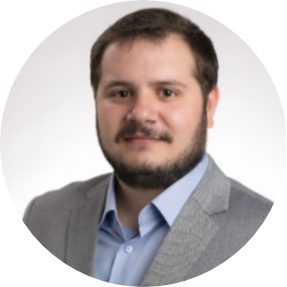

```{r setup, include=FALSE}
knitr::opts_chunk$set(echo = FALSE)

library(fontawesome)
fill <- "#2a9d8f"
```


<!-- <div class="about-container"> -->

<!-- <div class="about-fixed"> -->

<center>


<br>

<h2>Konstantinos Patelis</h2>
<h3>Credit Risk Analytics & Stress Testing</h3>

<h2>
    [`r fa("github", fill = fill)`](https://github.com/patelis)
    [`r fa("twitter", fill = fill)`](https://twitter.com/k_patelis)
    [`r fa("linkedin", fill = fill)`](https://www.linkedin.com/in/kospatelis/)
    [`r fa("envelope", fill = fill)`](kpatelis@outlook.com)
</h2>

</center>

<!-- </div> -->

<!-- <div class="about-flex-item">Put more and more random text here</div> -->

<!-- </div> -->
<div class="aligned">

Hey there! My name is Konstantinos Patelis, welcome to my blog!  

Originally from Athens, I finished my studies in Mechanical Engineering at the National Technical University of Athens, where I received my Master's equivalent diploma in 2015. One year later I moved to Zurich to study Management and Economics at ETH and in 2017 I started working in the risk analytics space. Currently, I'm working in credit risk analytics focusing on combined stress testing.  

I started using the [R statistical language](https://www.r-project.org/) when working on my thesis at ETH to both analyse the data and apply a modeling strategy, as well as write the entire documentation. Since then I have enjoyed using it in my day to day work to implement solutions that can significantly improve  my team's efficiency and productivity on our various workflows. One of the purposes of this blog is to showcase tools to replace traditional software used in enterprises in order to automate common tasks and unlock potential for value creation. In fact, even this blog was built using R and the [distill](https://rstudio.github.io/distill/) `r emo::ji("package")`.  

When not working or doing other R related stuff, I enjoy watching movies and good animated shows, playing board or computer games with friends, and recently making puzzles.  

</div>